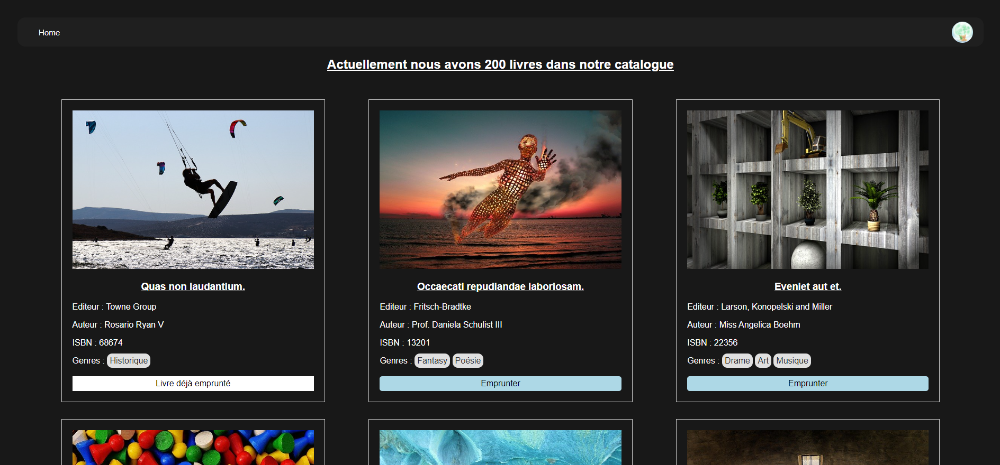
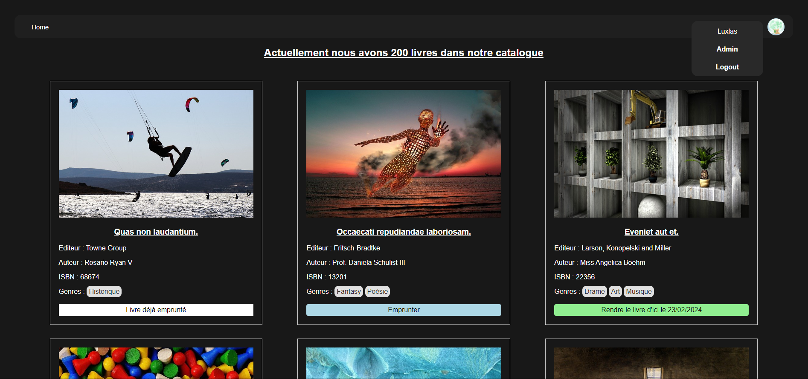
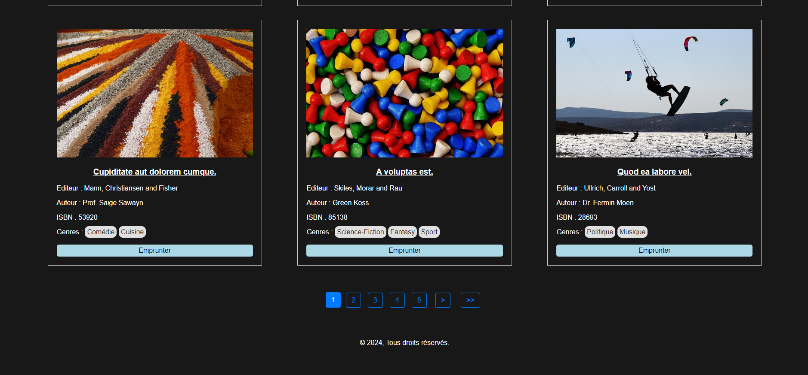
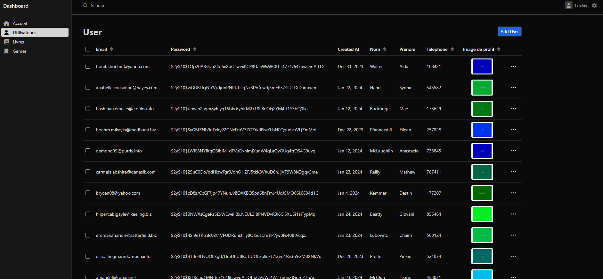
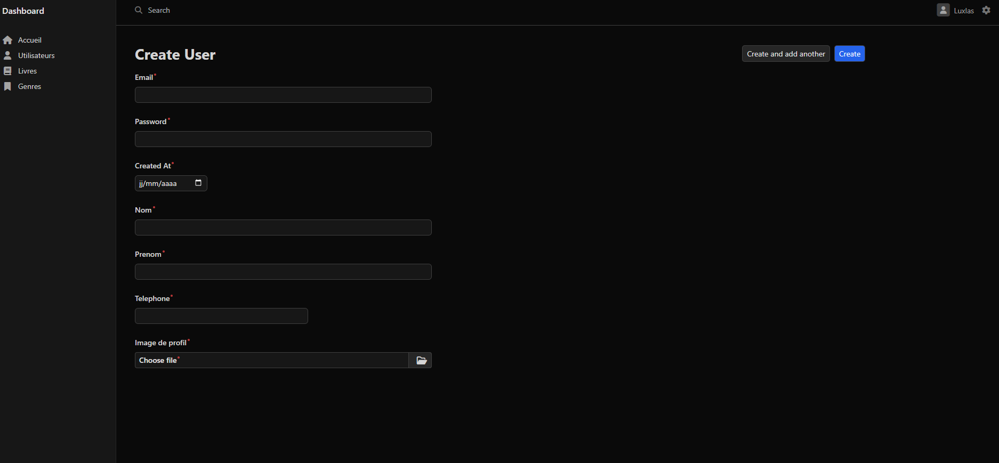
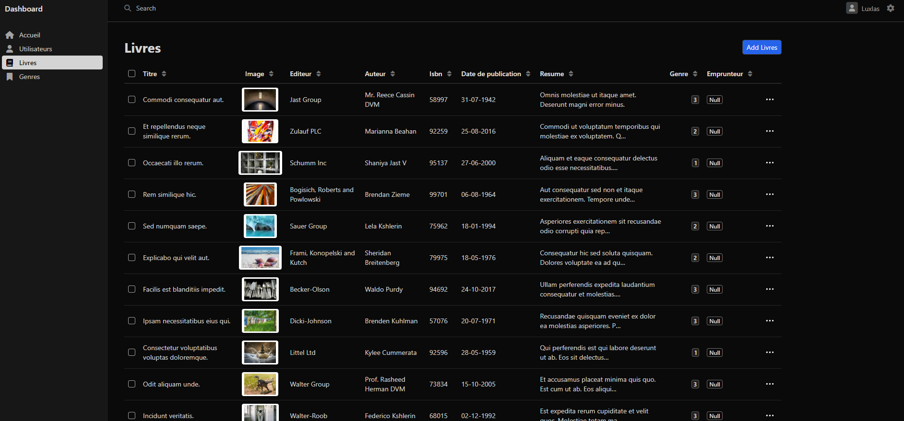
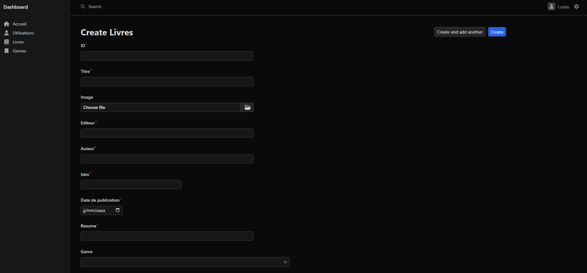
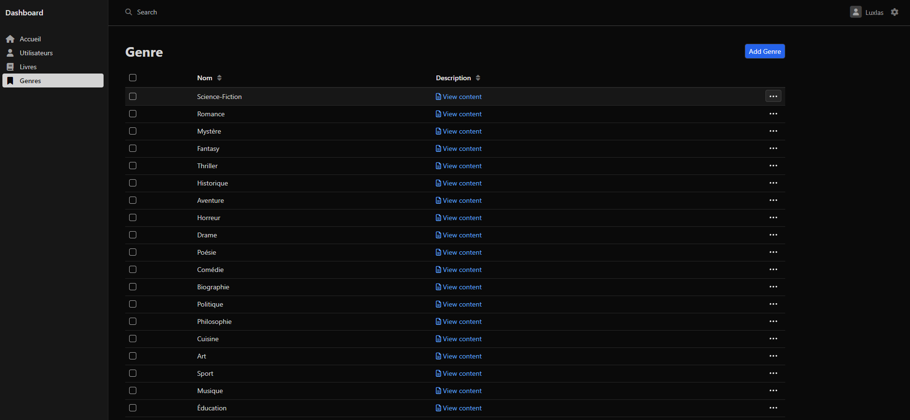
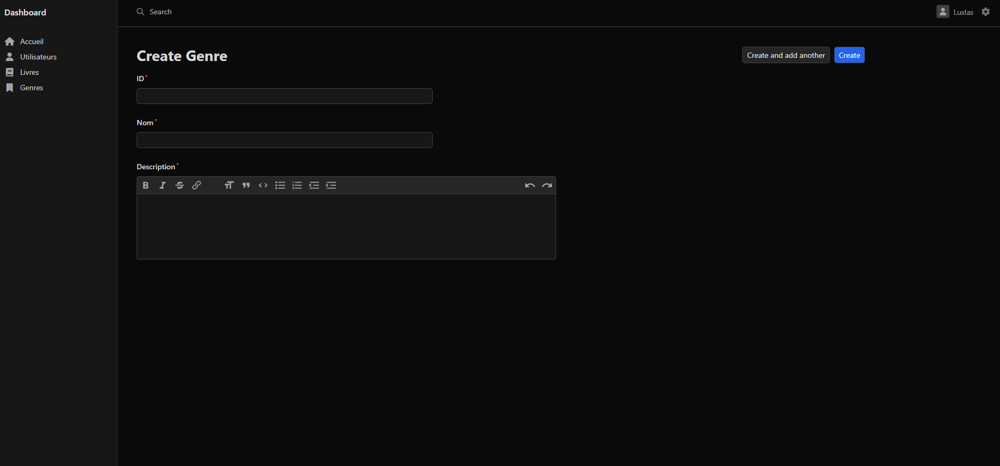

# Nom de Votre Projet

## Description

Ce projet est une application web développée avec Symfony permettant de gérer un catalogue de livres. Les fonctionnalités principales incluent l'affichage des livres, l'emprunt de livres par les utilisateurs, et la gestion des dates de rendu.

## Fonctionnalités

- Affichage des livres avec détails.
- Emprunt de livres par les utilisateurs.
- Affichage des utilisateurs et gestion des prêts.
- Gestion des dates de rendu.

## Technologies Utilisées

- Symfony: Framework PHP utilisé pour le développement de l'application.
- Twig: Moteur de template utilisé pour la gestion des vues.
- Doctrine: ORM utilisé pour interagir avec la base de données.
- EasyAdminBundle: Bundle utilisé pour créer une interface d'administration conviviale.

## Installation

Clonez le dépôt Git :

```bash
git clone https://github.com/votre-utilisateur/votre-projet.git
```
Installez les dépendances :

```bash
composer install
```

### Configurez la base de données :


```bash
php bin/console doctrine:database:create
```
```bash
php bin/console make:migration
```
```bash
php bin/console doctrine:migrations:migrate
```

### Lancez le serveur de développement :

```bash
symfony server:start
```

- Accédez à l'application dans votre navigateur à l'adresse http://localhost:8000.


### Configuration
Assurez-vous de configurer correctement votre base de données dans le fichier .env et d'ajuster les paramètres de sécurité selon vos besoins.

### Utilisation
- Connectez-vous à l'application en tant qu'administrateur.
- Explorez le catalogue de livres et gérez les emprunts.
- Vérifiez la gestion des dates de rendu.

- Si vous souhaitez contribuer à ce projet, veuillez ouvrir une issue ou soumettre une demande de tirage avec vos modifications.

## Les Fixtures

### Fixtures pour les Genres

Les fixtures pour les genres ajoutent différentes catégories de livres à la base de données. Ces catégories peuvent être associées à des livres pour indiquer leur genre. Pour charger ces fixtures, utilisez la commande Symfony suivante :

```bash
php bin/console doctrine:fixtures:load --append --group=genres
```

### Fixtures pour les Livres

Les fixtures pour les livres ajoutent des données fictives pour les livres, y compris le titre, l'éditeur, l'auteur, l'ISBN, la date de publication, l'image, le résumé et les genres associés. Pour charger ces fixtures, utilisez la commande Symfony suivante :

```bash
php bin/console doctrine:fixtures:load --append --group=livres
```

### Fixtures pour les Utilisateurs
Les fixtures pour les utilisateurs ajoutent des utilisateurs fictifs à la base de données. Chaque utilisateur a une adresse e-mail, un rôle, un mot de passe généré aléatoirement, une date de création, un nom, un prénom, un numéro de téléphone et une image de profil. Pour charger ces fixtures, utilisez la commande Symfony suivante :

```bash
php bin/console doctrine:fixtures:load --append --group=users
```

### Chargez toutes les Fixtures

Pour charger toutes les fixtures, utilisez la commande Symfony suivante :

```bash
php bin/console doctrine:fixtures:load --append
```

### Remarques :
- L'option ```--append``` est utilisée pour ajouter les fixtures sans supprimer les données existantes.

- Les fixtures pour les genres doivent être chargées avant les fixtures pour les livres, car les livres font référence à des genres existants.

- Assurez-vous de composer les commandes avec le chemin correct vers la console Symfony (bin/console) selon la structure de votre projet.

## Screenshots

## La page d'accueil

### La page d'accueil avec un utilisateur non connecté


### La page d'accueil avec un utilisateur connecté


### Le bas de la page d'accueil


## Le dashboard admin

### La page User list et User edit



### La page Livre list et Livre edit




### La page Genre list et Genre edit

 



## Auteur :
- [Maxime558](https://github.com/Maxime558)

## Licence :
Ce projet est sous licence [Creative Commons](LICENCE)